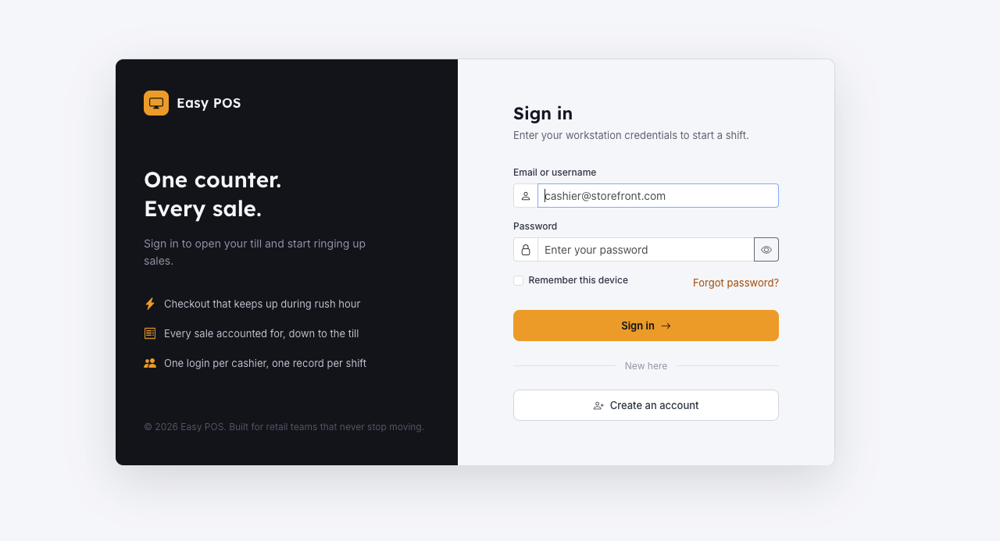
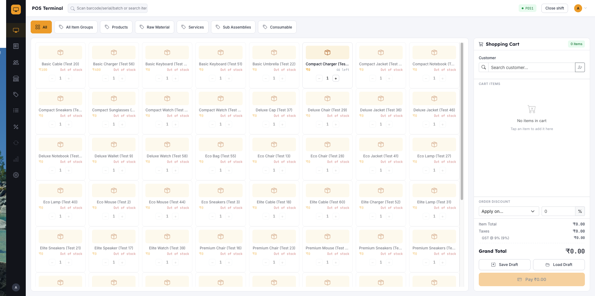
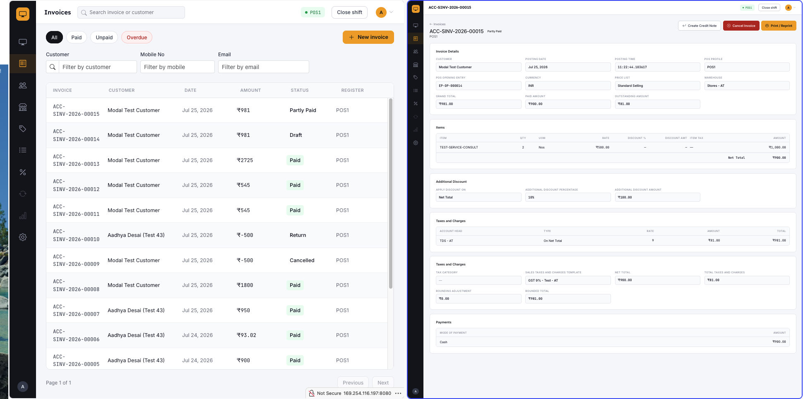
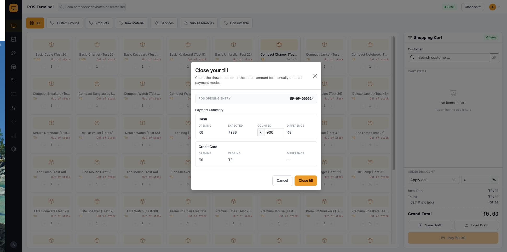

<p align="center">
  
</p>

<h1 align="center">Easy POS</h1>

<p align="center">
  A modern, open-source Point of Sale (POS) system for ERPNext / Frappe — built with React.
</p>

<p align="center">
  <a href="https://github.com/aashishvashisht6/EasyPOS/actions/workflows/ci.yml"></a>
  <a href="https://github.com/aashishvashisht6/EasyPOS/actions/workflows/linter.yml"></a>
  <a href="LICENSE"></a>
  
</p>

<!--
TODO: fill in / expand this section with your own words — intro, screenshots,
and any additional context you want future readers to have.
-->

## Introduction

**Easy POS** is a free, open-source Point of Sale (POS) application for **ERPNext and the Frappe Framework**, built as a modern React 19 single-page app (`posapp/`) and packaged as an installable Frappe app (`easy_pos`). It replaces the standard ERPNext POS screen with a purpose-built retail checkout experience — a fast cart-and-payment terminal, shift-based cash management, invoice and returns handling, and admin screens for POS Profiles, Price Lists, and Discounts — while reusing ERPNext's own **Sales Invoice**, **Customer**, and **POS Profile** doctypes as the system of record, so there is no separate database to keep in sync.

The project targets small and mid-size retail counters — shops, cafés, and multi-terminal stores already running ERPNext — that want a snappier, cashier-friendly POS UI without abandoning their existing accounting, inventory, and reporting stack. It is being built out in stages toward a fully **offline-first Progressive Web App**: today's release covers the full online checkout-to-close workflow (see [Features](#features)); RxDB-backed local storage, offline invoice queueing, and background sync are the next milestones on the [roadmap](#roadmap).

## Features

### 🧾 Checkout & Sales
- **POS Terminal** — cart-based checkout with live item search, quantity/rate editing, line and invoice-level discounts, and multi-mode (split) payments in one screen
- **Held / draft sales** — park an in-progress cart as a Draft invoice and pull it back into the terminal later via the draft picker, so a cashier can serve another customer without losing a sale
- **Discounts & pricing rules** — percentage, flat-amount, and free-item discounts sourced from ERPNext Pricing Rules, plus manual per-cart overrides
- **Price Lists** — manage item price lists and rates used to price the cart, independent of discount rules

### 🧮 Invoices & Returns
- **Invoice Register** — a searchable, filterable, paginated list of all POS Sales Invoices with status badges (Paid, Overdue, Draft, Return, ...)
- **Invoice detail view** — itemized line view, taxes and charges, additional discounts, and payment breakdown for any invoice
- **Cancel invoice** — cancel a submitted invoice with confirmation
- **Credit notes / returns** — issue a return against any non-return invoice; the backend recomputes taxes and totals against the return's own negative net total rather than trusting client math, and the resulting credit note carries the original invoice's POS profile and shift so it stays visible in reporting

### 👥 Customers
- Searchable, paginated customer directory with quick-create for walk-in and repeat customers, wired straight into the cart

### 🧑‍💼 Shift Management
- **Opening Entry** — start a shift by declaring an opening cash balance per payment mode, scoped to the cashier and POS Profile
- **Closing Entry** — reconcile counted vs. expected cash at end-of-shift, per payment mode, with each mode independently configurable as auto-calculated or manually counted
- Every sale, return, and closing figure is scoped to the shift it happened in (not just the POS Profile), so numbers can't leak across shifts sharing the same till

### ⚙️ Administration
- **POS Profile editor** — full CRUD editor for POS Profiles, including their `payments` child table (available payment modes) and the auto/manual closing behavior per mode
- **Settings hub** — a landing page for secondary/admin screens that don't warrant their own sidebar icon

### 🔌 Frappe-Native by Design
- Runs as a standard Frappe app (`bench get-app` / `bench install-app`) — no external services or databases to stand up
- Talks to Frappe over thin, purpose-built whitelisted API methods (`easy_pos/api/*.py`) rather than raw REST calls, keeping business logic (tax/total recalculation, shift scoping, permission checks) on the server where ERPNext already enforces it
- Every screen reuses ERPNext's real doctypes end-to-end, so invoices, customers, and stock movements created through Easy POS show up natively in ERPNext's own reports and ledgers

## Roadmap

Easy POS is being delivered in stages toward a fully offline-capable PWA. Shipped so far covers login, shift open/close, the sales terminal with split payments and discounts, invoice register, and returns. Still ahead:

- **Offline core** — RxDB (IndexedDB) local storage, offline PIN login, and an offline invoice mutation queue so the terminal keeps working through a dropped connection
- **Sync visibility** — a background sync engine with a dedicated screen (scaffolded today as a UI preview on the Sync page) showing pending changes, conflicts, and cache freshness per doctype
- **Reporting & hardware** — X/Z shift reports, barcode scanner input, and cash-drawer triggering

## Screenshots

<!-- Add real screenshots to the screenshots/ folder using the filenames below — see screenshots/README.md -->

| Login | Terminal |
| --- | --- |
|  |  |

| Invoices | Closing |
| --- | --- |
|  |  |

## Setup

### Install the app

```bash
cd $PATH_TO_YOUR_BENCH
bench get-app https://github.com/aashishvashisht6/EasyPOS --branch develop
bench install-app easy_pos
```

### Frontend development

```bash
cd posapp
yarn install
yarn dev      # start the Vite dev server
yarn build    # production build; also copies built HTML into the Frappe app
```

## How to Use

1. **Sign in** at `/posapp` with your workstation credentials.
2. **Open a shift** — enter your opening cash balances per payment mode to start a POS Opening Entry.
3. **Ring up sales** on the Terminal — search items, adjust quantities/discounts, and take payment across one or more modes.
4. **Manage invoices** — view, cancel, or issue a credit note (return) from the Invoices page.
5. **Close your shift** — reconcile counted cash against expected totals per payment mode and submit the closing entry.

## Dependencies

**Frontend** (`posapp/`)
- React 19, React Router 7
- Zustand 5 (global state)
- Bootstrap 5 + Bootstrap Icons
- Vite 7

**Backend**
- Frappe Framework
- ERPNext (Sales Invoice, Customer, POS Profile doctypes)

## Contributing

This app uses `pre-commit` for code formatting and linting. Please [install pre-commit](https://pre-commit.com/#installation) and enable it for this repository:

```bash
cd apps/easy_pos
pre-commit install
```

Pre-commit is configured to use the following tools for checking and formatting your code:

- ruff
- eslint
- prettier
- pyupgrade

For frontend-only changes, also run `cd posapp && npx eslint .` before committing.

### CI

This app uses GitHub Actions for CI:

- **CI** — installs this app and runs unit tests on every push to `develop`.
- **Linters** — runs [Frappe Semgrep Rules](https://github.com/frappe/semgrep-rules) and [pip-audit](https://pypi.org/project/pip-audit/) on every pull request.

## Bugs and Feature Requests

Found a bug or have an idea? Please open an issue using one of the templates:

- [🐛 Report a bug](https://github.com/aashishvashisht6/EasyPOS/issues/new?template=bug_report.md)
- [✨ Request a feature](https://github.com/aashishvashisht6/EasyPOS/issues/new?template=feature_request.md)

## License

MIT — see [LICENSE](LICENSE).
